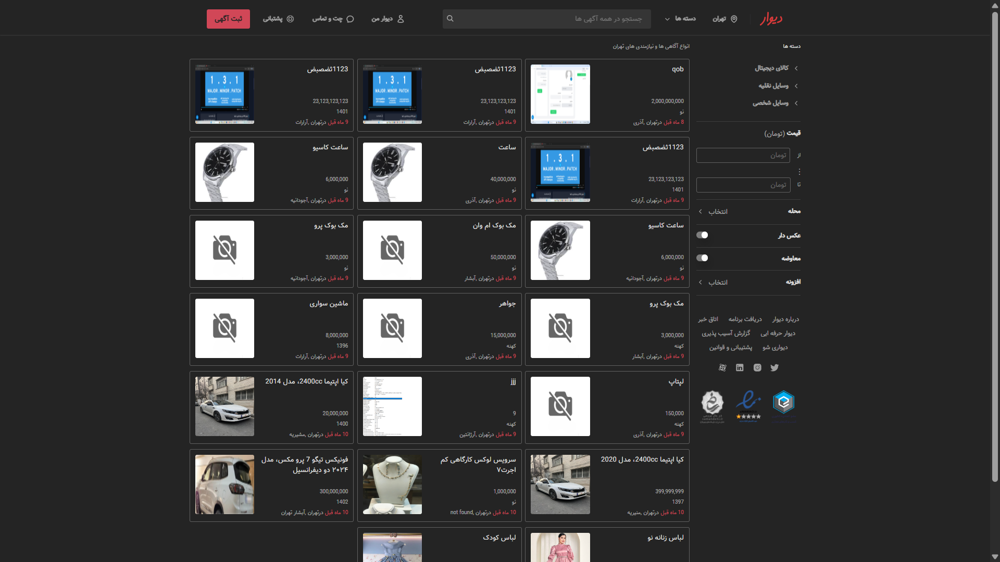

# Divar Clone -- HTML, CSS (Tailwind), Vanilla JS

A fully-functional, mobile-first Divar-style marketplace built from
scratch using **HTML**, **TailwindCSS**, and **Vanilla JavaScript**.
---
## 📷 Screenshots 

## 🚀 Demo

👉 **Live Demo:** https://SamaManavi.github.io/Divar/public

## 📌 Overview

This project is a complete clone of the Divar marketplace experience.\
Includes full authentication, multi-level categories, ad creation, city
modal, profile page, notes system, bookmarks, and responsive UI.

## ✨ Key Features

### Authentication

-   Token-based login system
-   Login with mobile number
-   OTP verification (default code: 1111)

### Ad System

-   Create Ad form
-   3-level category system
-   Bookmark ads
-   Personal notes on each ad
-   Last 10 viewed ads saved in LocalStorage

### UI Components

-   City selection modal
-   Login modal
-   User account page
-   Fully responsive layout

### Used Libraries

-   Choices.js
-   Leaflet
-   SweetAlert
-   Swiper.js

## 🛠 Tech Stack

-   HTML
-   TailwindCSS
-   Vanilla JavaScript

## 📄 License

This project is licensed under the MIT License.
